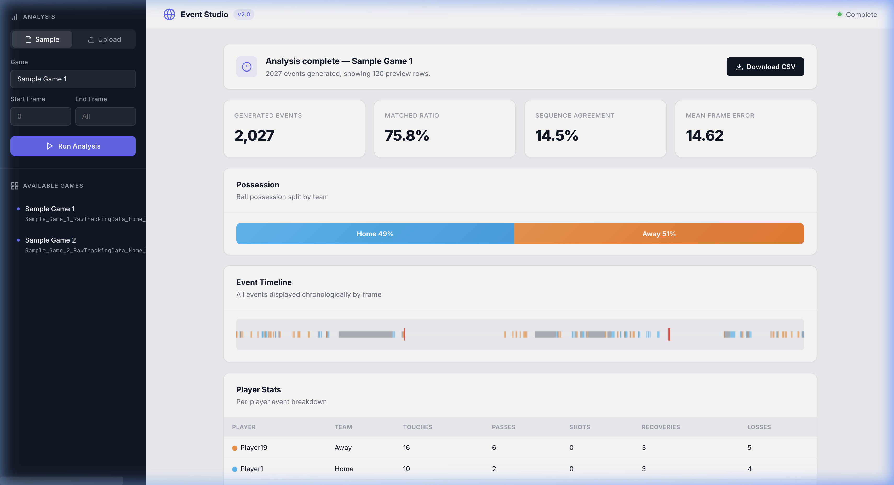
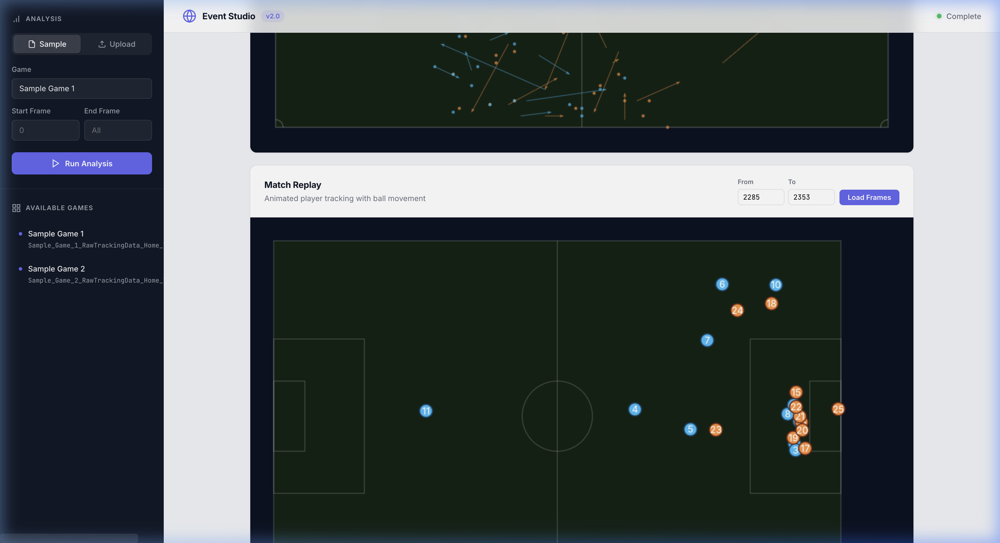
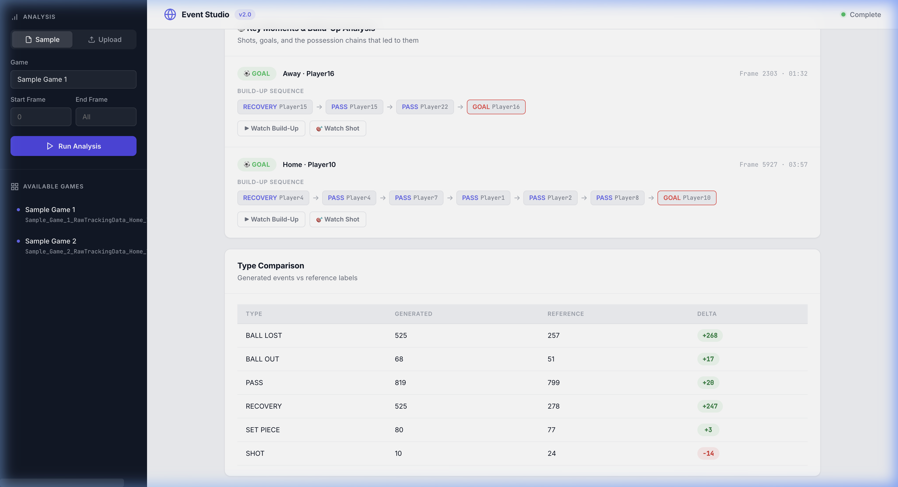
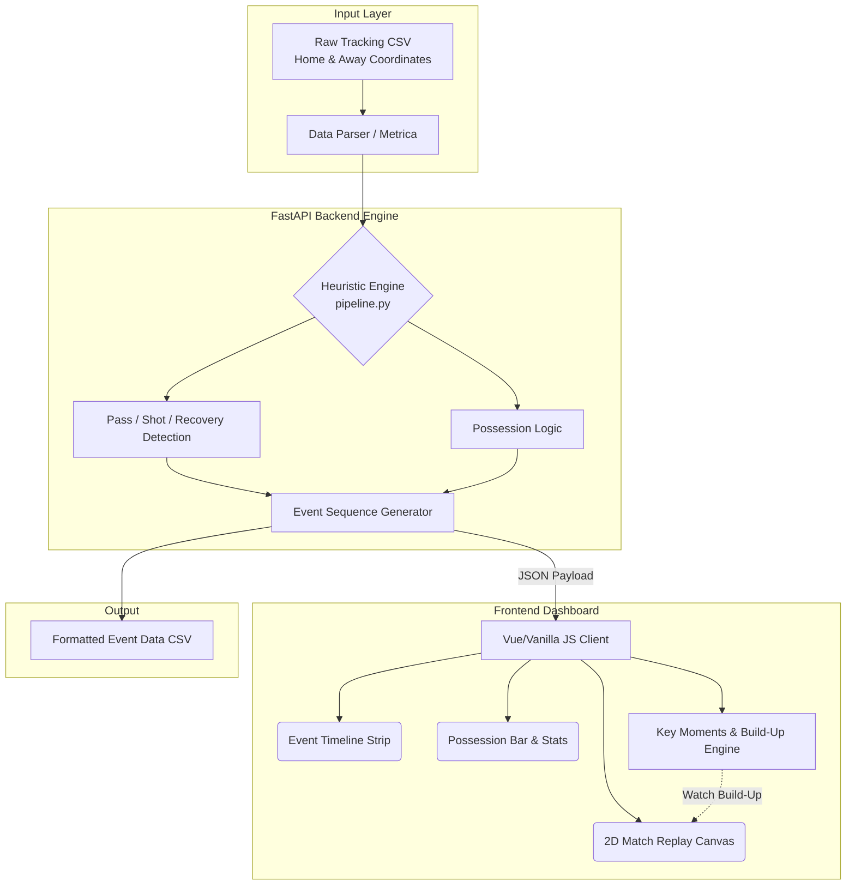

<p align="center">
  
</p>

# ⚽ Tracking to Event Studio


**Tracking to Event Studio** is a professional-grade analytical dashboard that automatically converts raw, low-frequency football tracking data (e.g., player coordinates) into rich, high-frequency event sequences (Passes, Shots, Recoveries, Ball Losses, etc.).

Originally inspired by and built upon the core heuristic algorithms from [JohnComonitski/TrackingDataToEventData](https://github.com/JohnComonitski/TrackingDataToEventData), this project completely redesigns the experience into a modern, interactive web application featuring a stunning UI and advanced coaching analytics.

## 🌟 Key Features

### 1. Advanced Analytics Dashboard
- **Instant Insights**: Instantly view generated event counts, matched ratios against reference data, and mean frame error metrics.
- **Player Stats**: Automatically calculated touches, passes, shots, recoveries, and losses for every player on the pitch.
- **Possession Tracking**: Dynamic "Home vs Away" possession percentage bar based on ball control durations.

### 2. 🎬 Animated Match Replay & Pitch Visualization
- **2D Event Map**: Static pitch drawing of all detected events (passes, shots, etc.) across the game.
- **Interactive Replay**: Watch the players and the ball move in real-time. Features include **Scrubbing, Play/Pause, and Speed Controls**.
- **Coach's View**: Replay includes **Player Jersey Numbers** and a **Ball Movement Trail** to easily track patterns of play.

<p align="center">
  
</p>

### 3. 🎯 Key Moments & Build-Up Play Analysis
- Automatically detect **Goals and Shots**.
- **Trace the Build-up**: The engine works backwards from every shot to map the unbroken sequence of passes and recoveries that led to the event.
- **Watch Build-Up**: Click a button to instantly auto-load the exact frame sequence of the build-up chain into the Match Replay.

<p align="center">
  
</p>

## ⚙️ System Architecture



## 🚀 Quick Start (Docker)

The fastest and easiest way to use the dashboard is via Docker.

```bash
# 1. Clone the repository
git clone https://github.com/YOUR_USERNAME/TrackingDataToEventData.git
cd TrackingDataToEventData

# 2. Build the Docker image
docker build -t tracking-to-event .

# 3. Run the container
docker run -p 8000:8000 tracking-to-event
```

**Open your browser and navigate to `http://localhost:8000`.**

## 💻 Manual Setup (Python)

If you prefer to run it locally without Docker:

```bash
# 1. Create a virtual environment
python -m venv venv
source venv/bin/activate  # On Windows: venv\Scripts\activate

# 2. Install dependencies
pip install -r requirements.txt

# 3. Start the FastAPI server
uvicorn web:app --reload --host 0.0.0.0 --port 8000
```


## 📂 Project Structure

- `tracking_to_event/models.py`: Core data classes (Player, Frame, Event)
- `tracking_to_event/pipeline.py`: The event extraction engine (Heuristics, Velocity tracking, Possession Logic)
- `tracking_to_event/validation.py`: Scoring engine comparing generated vs. human-annotated reference events
- `web.py`: FastAPI server handling data parsing, algorithm execution, and serving the frontend
- `tracking_to_event/templates/index.html`: Modern, card-based premium UI layout
- `tracking_to_event/static/app.js`: Complex frontend logic handling HTML5 Canvas rendering, replay animations, and build-up chain tracing

## 🤝 Acknowledgements

- Core extraction algorithms inspired by [JohnComonitski/TrackingDataToEventData](https://github.com/JohnComonitski/TrackingDataToEventData).
- Dataset provided by Metrica Sports.

## 📄 License

This project is licensed under the MIT License - see the LICENSE file for details.
