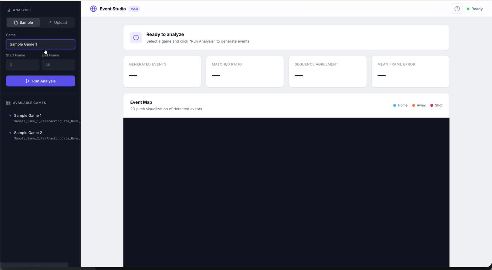
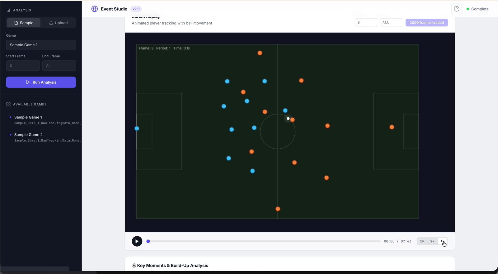
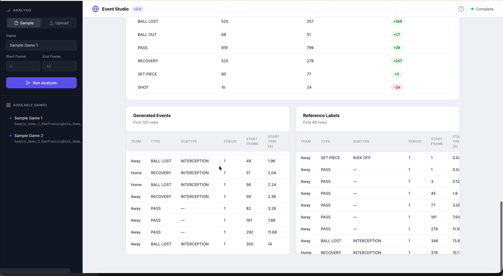
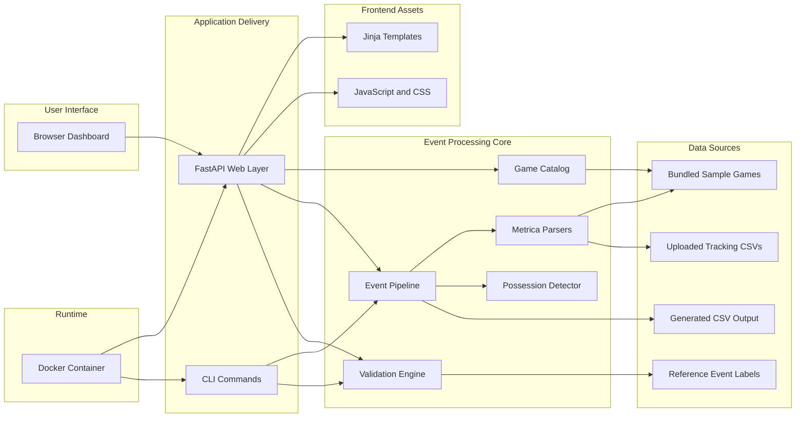

# Tracking to Event Studio

Tracking to Event Studio is a professional football analytics application that converts raw tracking data into structured event data, then presents the result through a browser-based review workflow with validation metrics, replay, and build-up analysis.

This repository is an extended continuation of the original idea from John Comonitski. The original project explored converting tracking data into event data; this fork pushes the idea further with a packaged web application, a cleaner operator workflow, richer visualization, replay tooling, documentation, and deployment readiness.



## Repository Lineage

- Original repository: [JohnComonitski/TrackingDataToEventData](https://github.com/JohnComonitski/TrackingDataToEventData)
- Maintained and extended fork: [bishaldan/TrackingDataToEventData](https://github.com/bishaldan/TrackingDataToEventData)

This fork keeps the core idea of generating event data from tracking data and extends it with:

- FastAPI-based application delivery
- Browser dashboard for analysis and replay
- sample-game validation workflow
- upload flow for custom CSVs
- Dockerized runtime
- stronger documentation and repo presentation
- basic runtime hardening for safer packaging

## Product Walkthrough

The walkthrough video from your recorded demo is already included in this repository:

- Video file: [docs/media/event-studio-walkthrough.mp4](docs/media/event-studio-walkthrough.mp4)
- GitHub-facing tutorial link: [Watch the walkthrough](docs/media/event-studio-walkthrough.mp4)

What the walkthrough demonstrates:

1. Open the dashboard and select a built-in sample game.
2. Run event generation for the chosen frame range.
3. Review the generated-event metrics and validation summary.
4. Inspect the 2D pitch view and event distribution.
5. Load replay frames and inspect movement sequences.
6. Compare generated events with reference labels.

Additional walkthrough screenshots:




## What The System Does

At a high level, the system accepts football tracking CSV files, parses them into frame records, detects possessions and ball state transitions, transforms those detections into event rows, validates them against reference data when available, and exposes everything through a web interface and CLI.

Primary capabilities:

- generate event data from Metrica-style tracking CSV files
- validate generated data against bundled reference event labels
- render event maps on a 2D football pitch
- replay sampled tracking frames in the browser
- surface key moments and attacking build-up sequences
- export generated event data as CSV
- run locally or inside Docker

## System Architecture

The architecture is intentionally compact: one Python application process, one web layer, one event-generation pipeline, and a browser client.



## Architecture Breakdown

### 1. Presentation Layer

The presentation layer is the browser dashboard served by FastAPI.

- [`tracking_to_event/templates/index.html`](tracking_to_event/templates/index.html) renders the base UI
- [`tracking_to_event/static/app.js`](tracking_to_event/static/app.js) handles form submission, results rendering, replay loading, and key-moment interactions
- [`tracking_to_event/static/app.css`](tracking_to_event/static/app.css) provides the application styling

Responsibilities:

- let analysts choose a sample game or upload custom files
- send analysis requests to the API
- display validation metrics and event tables
- render the pitch visualization
- control replay playback and build-up review

### 2. API Layer

The API layer is implemented in [`tracking_to_event/web.py`](tracking_to_event/web.py).

Key routes:

- `/` serves the dashboard
- `/healthz` exposes container and runtime health
- `/api/games` lists bundled sample games
- `/api/analyze` runs event generation for a sample game
- `/api/upload` processes uploaded CSV files
- `/api/download` exports generated CSV output
- `/api/frames` returns sampled tracking frames for replay

Responsibilities:

- input validation
- upload validation and temporary file handling
- security headers
- orchestration between browser requests and the pipeline
- serialization of results into API responses

### 3. CLI Layer

The CLI is implemented in [`tracking_to_event/cli.py`](tracking_to_event/cli.py).

Supported commands:

- `generate` to write generated event CSV output
- `validate` to compare against reference labels
- `test` to run the automated test suite
- `serve` to launch the web application

This layer makes the project usable both as a dashboard and as a scriptable local tool.

### 4. Data Ingestion Layer

Tracking ingestion is implemented in [`tracking_to_event/metrica.py`](tracking_to_event/metrica.py).

Responsibilities:

- locate sample-game data files
- read home and away tracking files
- align frame rows across both teams
- construct normalized frame records
- expose iterators for downstream processing

Input types:

- bundled sample data from `data/Sample_Game_*`
- uploaded home and away tracking CSV files

### 5. Detection Layer

Possession and ball-state detection is implemented in [`tracking_to_event/detector.py`](tracking_to_event/detector.py).

Responsibilities:

- evaluate ball control using geometric heuristics
- detect team possession segments
- identify possession switches
- capture ball-out and goal-like transitions

This is the rule-based intelligence layer that bridges tracking positions and structured football events.

### 6. Event Pipeline Layer

The event orchestration layer is implemented in [`tracking_to_event/pipeline.py`](tracking_to_event/pipeline.py).

Responsibilities:

- call frame iterators
- pass frames into the detector
- convert segments into event records
- assemble pandas dataframes
- export CSV output

Representative pipeline functions:

- `generate_events_for_game`
- `generate_events_from_paths`
- `generate_dataframe_for_game`
- `generate_dataframe_from_paths`
- `build_events_from_segments`

### 7. Validation Layer

Validation lives in [`tracking_to_event/validation.py`](tracking_to_event/validation.py).

Responsibilities:

- load reference event labels for bundled games
- compare generated output against supported reference rows
- compute type counts, match ratios, sequence agreement, and frame error
- return structured validation reports to both CLI and API consumers

### 8. Data And Storage Model

This project does not use a database. It is file-driven.

Persistent data inputs:

- sample tracking CSV files
- sample reference event CSV files
- uploaded CSVs during live sessions

Persistent outputs:

- generated event CSV files written by CLI commands or downloaded via API

This keeps the system simple, reproducible, and easy to run locally.

## End-To-End Request Flow

### Sample Game Analysis Flow

1. The browser calls `/api/analyze`.
2. FastAPI validates the request parameters.
3. The pipeline loads the selected sample tracking files.
4. The Metrica parser yields frame records.
5. The detector identifies possession and ball-out segments.
6. The pipeline converts segments into event rows.
7. The validation layer compares them with bundled reference labels.
8. FastAPI returns metrics, preview rows, and a download URL.
9. The browser renders the metrics, pitch map, tables, and key moments.

### Upload Flow

1. The browser posts two CSV files to `/api/upload`.
2. FastAPI validates the file names, content shape, and size limits.
3. Files are written to a temporary directory.
4. The same pipeline runs against those uploaded paths.
5. FastAPI returns the generated event preview and an in-memory CSV export.

### Replay Flow

1. The browser requests `/api/frames`.
2. FastAPI samples frame data at a bounded sample rate.
3. Player and ball coordinates are returned to the frontend.
4. The JavaScript replay layer animates the movement on the pitch canvas.

## Code Map

Important files and what they own:

- [`tracking_to_event/web.py`](tracking_to_event/web.py): API endpoints, upload handling, health check, response headers
- [`tracking_to_event/cli.py`](tracking_to_event/cli.py): CLI entrypoints
- [`tracking_to_event/pipeline.py`](tracking_to_event/pipeline.py): event orchestration and dataframe generation
- [`tracking_to_event/detector.py`](tracking_to_event/detector.py): possession and transition detection
- [`tracking_to_event/metrica.py`](tracking_to_event/metrica.py): tracking-data parsing
- [`tracking_to_event/validation.py`](tracking_to_event/validation.py): reference comparison and scoring
- [`tracking_to_event/events.py`](tracking_to_event/events.py): event construction helpers
- [`tracking_to_event/catalog.py`](tracking_to_event/catalog.py): sample-game discovery
- [`tests/test_web.py`](tests/test_web.py): API and web behavior checks
- [`tests/test_pipeline.py`](tests/test_pipeline.py): pipeline behavior checks

## Repository Structure

```text
.
├── Dockerfile
├── README.md
├── data/
├── docs/
│   ├── images/
│   └── media/
├── tests/
├── tracking_to_event/
│   ├── static/
│   ├── templates/
│   └── *.py
└── utils/
```

## Quick Start With Docker

Build the image:

```bash
docker build -t tracking-to-event .
```

Run the application:

```bash
docker run --rm -p 8000:8000 tracking-to-event
```

Open [http://localhost:8000](http://localhost:8000).

Health check:

```bash
curl http://127.0.0.1:8000/healthz
```

## Local Development

Install dependencies:

```bash
python3 -m pip install -r requirements.txt
```

Run the dashboard locally:

```bash
python3 -m tracking_to_event serve --host 127.0.0.1 --port 8000 --data-dir data
```

Run the tests:

```bash
python3 -m tracking_to_event test
```

Generate events from a sample match:

```bash
python3 -m tracking_to_event generate --data-dir data --game-id 1 --output out/game_1_events.csv
```

Validate a sample match:

```bash
python3 -m tracking_to_event validate --data-dir data --game-id 1
```

## Security And Runtime Notes

This repository is now packaged more professionally for sharing and deployment.

Implemented hardening:

- CSV upload validation by extension and content shape
- per-file upload size limit
- frame-range validation
- replay sample-rate bounds
- security response headers
- non-root Docker runtime
- application health endpoint for container checks

Operational note:

This is still an analytics application intended for trusted operators, not a full internet-exposed multi-tenant SaaS. If you deploy it publicly, add authentication, TLS termination, ingress controls, and rate limiting in front of it.

## Testing And Verification

The current repository has been verified with:

- containerized test execution
- Docker image rebuild and runtime smoke tests
- health-check validation
- sample-game API execution

## Credits

Credit for the original idea and early implementation direction belongs to John Comonitski and the original repository:

- [JohnComonitski/TrackingDataToEventData](https://github.com/JohnComonitski/TrackingDataToEventData)

This fork continues that work with a more complete application and developer-ready packaging.
