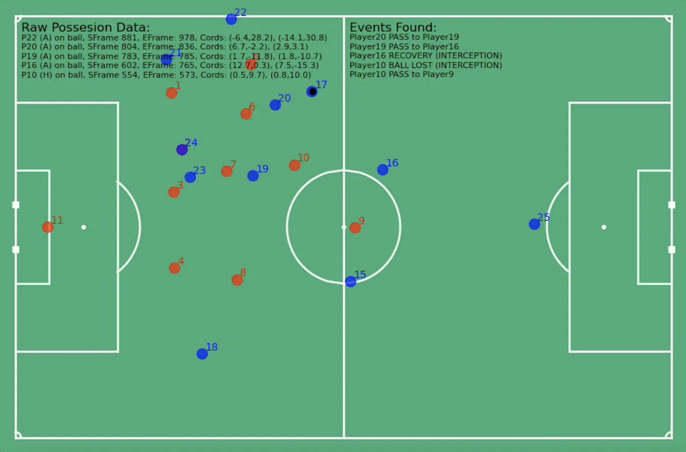

# Tracking Data To Event Data
A Python script to convert football tracking data into event data following Metrica's style of Event Data. Learn more about the creation of this script from my [Medium Article](https://medium.com/p/1730c58ad598?postPublishedType=initial).



## Getting Started

1. Clone the repository

   ```shell
   git clone https://github.com/JohnComonitski/TrackingDataToEventData.git
   ```

2. From the `./TrackingDataToEventData` directory, clone the Football Match Analysis library

   ```shell
   git clone https://github.com/JohnComonitski/TrackingDataToEventData.git
   ```

3. Create and activate a Python
   [virtual environment](https://docs.python.org/3/library/venv.html#creating-virtual-environments).
   On GNU/Linux systems this is as easy as:

   ```shell
   python3 -m venv .venv
   . .venv/bin/activate
   # Work inside the environment.
   ```

4. Install the Python dependencies

   ```shell
   pip install -r requirements.txt
   ```

5. In `generate_event_data.py` edit the 'Getting Started' parameters as you see fit.

    ```# Data Source
    DATADIR = './data'
    game_id = 1
    
    # Script Parameters
    generate_video = False # Generate video from snalysis
    print_frames = True    # Print Frames (for debuging)
    start_frame = 0        # Start Frame
    end_frame = 4000       # End Frame
    ```
    
6. Run `generate_event_data.py` to start generating event data!
